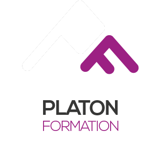
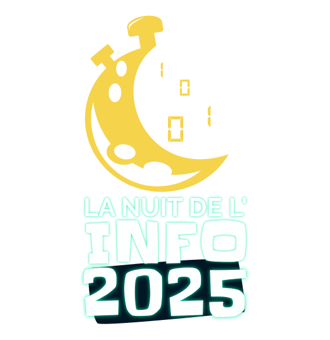
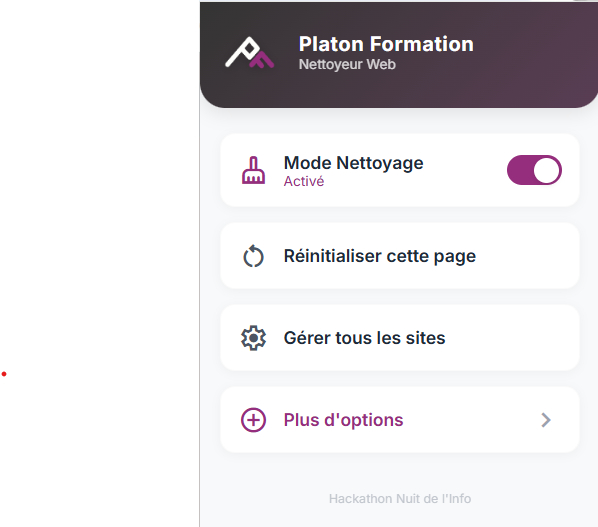
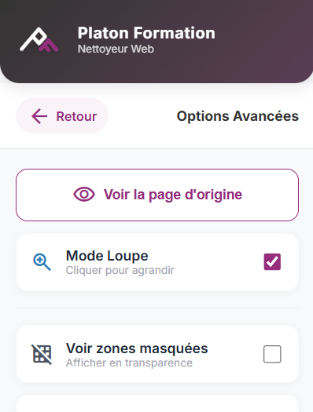
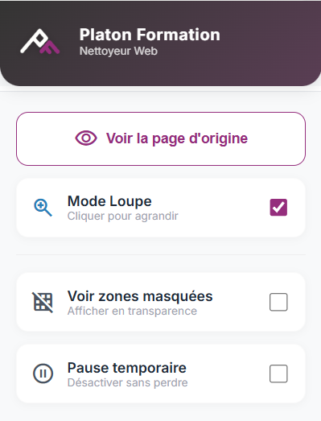

  
  

  <strong>Nettoyez le web comme VOUS l'entendez !</strong> 
  Projet Nuit de l'Info 2025 par la Team <strong>FC PHP MAFIA</strong>

---

  
  
  

## 📸 Aperçu de l'Interface

    
    
    

---

## ✨ Guide d'installation

Cette extension n'étant pas encore sur le Chrome Web Store, elle doit être installée en **mode développeur**. C'est très simple et prend moins d'une minute.

### 🎯 1. Préparation
1.  **Téléchargez** le code source de ce projet (Zip ou `git clone`).
2.  Décompressez le dossier si nécessaire.

### 🔧 2. Installation dans Chrome
1.  Ouvrez Google Chrome.
2.  Dans la barre d'adresse, tapez : `chrome://extensions` et validez.
3.  En haut à droite, activez le bouton **Mode développeur** (le switch doit être bleu).
4.  Cliquez sur le bouton **Charger l'extension non empaquetée** (en haut à gauche).
5.  Sélectionnez le dossier **racine** du projet (`platon-web-cleaner`) qui contient le fichier `manifest.json`.

📌 **Astuce :** Cliquez sur l'icône "Puzzle" 🧩 en haut à droite de votre navigateur et épinglez **Platon Formation** pour l'avoir toujours sous la main.

---

## 🧪 Comment tester l'extension ?

⚠️ **Important :** Les extensions ne fonctionnent pas sur les pages système de Chrome (comme l'accueil vide ou les paramètres).

1.  **Allez sur un vrai site web** (ex: [Wikipedia](https://fr.wikipedia.org/), [Le Monde](https://www.lemonde.fr/), ou n'importe quel site avec du contenu).
2.  **Rafraîchissez la page (Touche F5)**. *C'est indispensable la première fois pour charger le script.*
3.  Ouvrez l'extension Platon.
4.  Activez le **Mode Nettoyage** (le switch devient violet).
5.  Passez votre souris sur la page : les éléments s'encadrent en **Rouge**.
6.  **Cliquez** pour supprimer un élément !

### 🕵️ Tester les Bonus
1.  Dans le menu de l'extension, cliquez sur **"Plus d'options >"**.
2.  Activez le **Mode Loupe** : le cadre devient **Bleu**. Cliquez sur un texte pour l'agrandir.
3.  Cochez **Voir zones masquées** pour voir en transparence ce que vous avez supprimé.

---

Projet réalisé avec ❤️ et beaucoup de ☕ durant la Nuit de l'Info 2025.

Team : FC PHP MAFIA

GIMENEZ Paul et ELOIRE Mathis de l'IUT Informatique de Bayonne et du Pays-Basque.